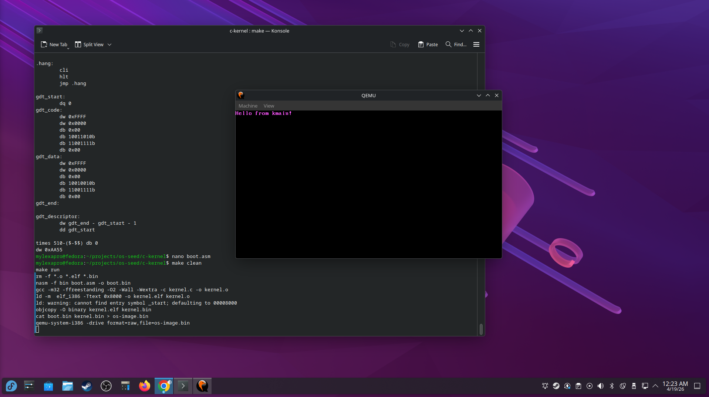
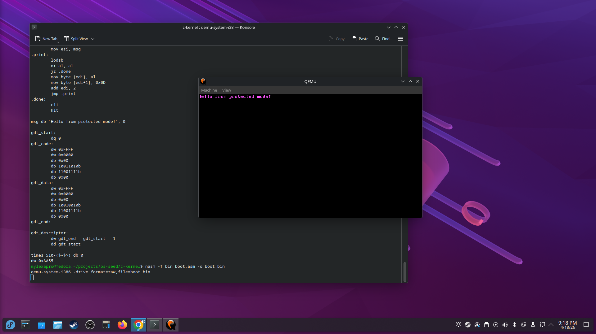
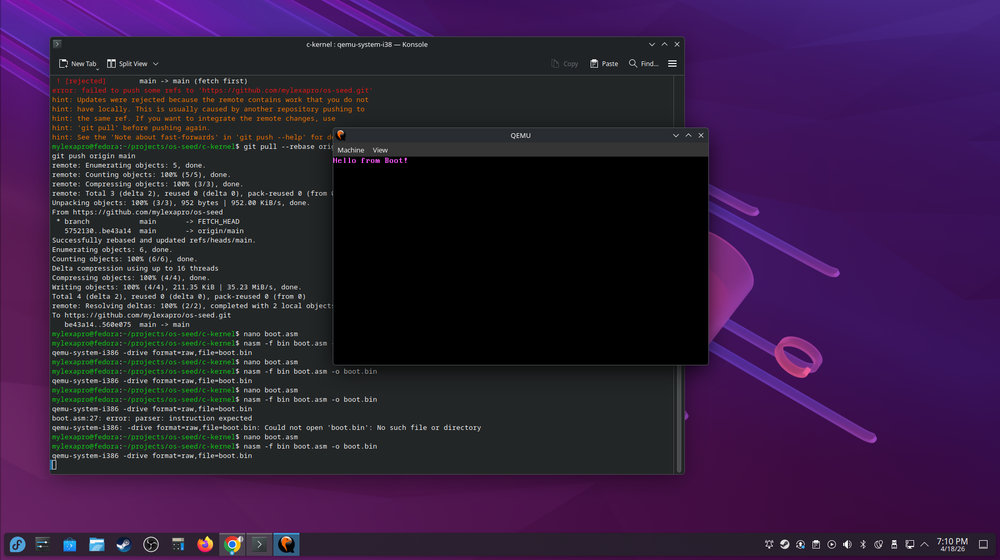
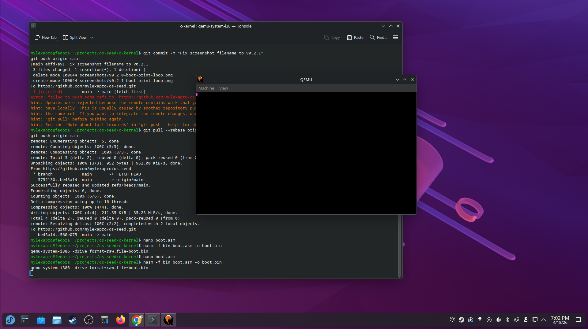
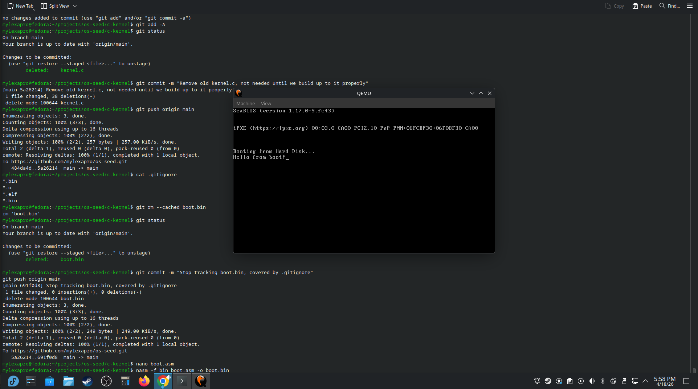
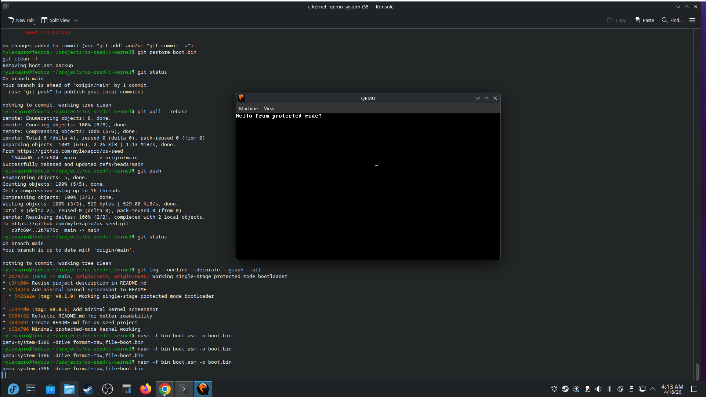

# os-seed

A bare-metal operating system built from scratch — no libraries, no OS underneath,
just assembly code talking directly to hardware. This is my hands-on journey into
how computers actually work at the lowest level.

---

## 🚀 Current Status

**Version:** v1.0.0 — "C Kernel Boots"

The OS currently:

- Boots from a custom 512-byte boot sector written in x86 assembly
- Uses BIOS interrupt int 0x13 to load the kernel from disk into memory
- Sets up a Global Descriptor Table (GDT)
- Switches the CPU from 16-bit real mode into 32-bit protected mode
- Jumps to a C kernel at 0x8000
- kmain() prints "Hello from kmain!" in hot pink directly to VGA memory
- Built with a Makefile — single `make run` command to build and launch

Fully reproducible with:

```
make run
```

---

## 🧠 What I'm Learning

- What actually happens between pressing power and seeing an OS
- How the BIOS loads the first 512 bytes of a drive into RAM at address 0x7C00
- What real mode is and why every x86 CPU starts there
- How BIOS interrupts work (ringing a bell to ask the BIOS to do something)
- How memory addresses and hexadecimal relate to physical RAM
- How to write and assemble x86 assembly with NASM
- How to test bare-metal code with QEMU without real hardware

---

## 🗂️ Project Structure
```
boot.asm     → 512-byte bootloader, loads kernel, switches to protected mode
kernel.c     → C kernel, kmain() entry point
linker.ld    → tells linker where to place code in memory
Makefile     → builds and runs everything with a single command
```
---

## 🧭 Roadmap

### ✔️ Completed

- Load and Call a C kernel (kmain)
- Build a Makefile
- Enter 32-bit Protected Mode
- Set up a Global Descriptor Table (GDT)
- Switch from BIOS interrupts to direct VGA memory writes at 0xB8000
- Write a Print Loop (prints entire string instead of one letter at a time)
- Boot sector that loads and runs
- BIOS interrupt-based character output
- Clean CPU halt
- Git versioning from the start

### 🔜 Next Steps

- Add a proper VGA text driver with cursor support
- Implement a printf function for formatted output
- Set up the Interrupt Descriptor Table (IDT)
- Handle keyboard interrupts
- Remap the Programmable Interrupt Controller (PIC)
- Implement memory detection
- Add basic memory management
- Build a simple shell

### 📅 Later

- Memory paging
- Userland processes
- Filesystem support
- Rust kernel modules

---

## 📝 Versioning

- v0.1.x — old experiments (scrapped, clean slate taken)
- v0.2.0 — minimal boot sector, prints "Hi" using BIOS interrupt
- v0.2.1 — print loop, prints full string using BIOS interrupt
- v0.3.0 — direct VGA write, no BIOS, hot pink text, screen clear
- v0.4.0 — protected mode, GDT, 32-bit, full string in hot pink
- v1.0.0 — C kernel boots, kmain() called from bootloader

---

## 📸 Screenshots

### v1.0.0 — C kernel boots, kmain() running


### v0.4.0 — Protected mode, full string, hot pink


### v0.3.0 — Direct VGA write, full string, hot pink


### v0.2.3 — Direct VGA write, clear screen, single char


### v0.2.2 — Direct VGA write, single char, no clear


### v0.2.1 — BIOS print loop, full string


### v0.1.x — Old experiments (pre clean slate)



---

## 💬 About This Project

os-seed is a long-term learning project. I'm autistic and learn best by building
real things, so this repo documents my actual progression — every commit is a
working state I understand, not just code I copied.

The goal isn't to ship a production OS. The goal is to genuinely understand how
computers work from the ground up.
