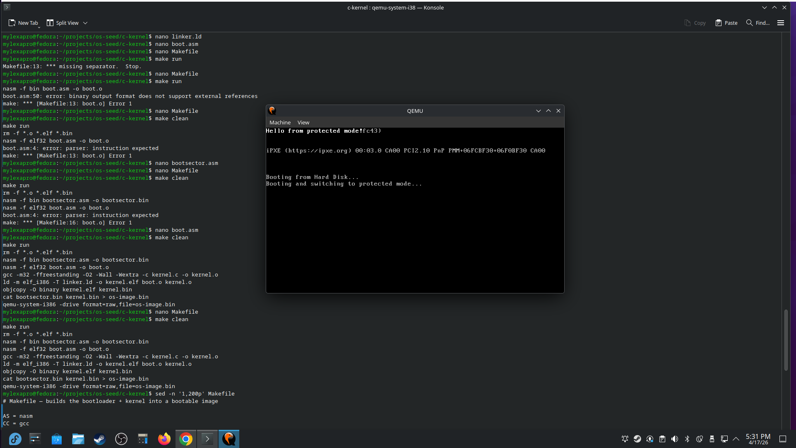

# os-seed
A tiny 32‑bit operating system seed built from scratch — bootloader, protected mode, and a minimal kernel written in C and assembly. This project is my hands‑on journey into systems engineering, OS internals, and low‑level computer architecture.

---

## 🚀 Current Status
**Version:** v0.0.1 — “Protected Mode Online”

The OS currently:
- Boots from a custom 512‑byte boot sector
- Sets up a Global Descriptor Table (GDT)
- Switches the CPU into 32‑bit protected mode
- Jumps into a freestanding C kernel
- Writes directly to VGA text memory

This is the minimal foundation every real OS starts from.

---

## 🧠 What I'm Learning
- How CPUs boot and execute the first instruction
- BIOS vs. protected mode
- Memory segmentation and the GDT
- How to write freestanding C without a standard library
- How to control hardware directly (VGA text mode)
- How to structure a multi‑stage OS

This repo is intentionally public so I can show my progression over time.

---

## 🗂️ Project Structure
/boot/        → bootloader, GDT, protected mode switch  
/kernel/      → 32‑bit C kernel  
linker.ld     → custom linker script  
Makefile      → build + run with QEMU  
os-image.bin  → final bootable image  

---

## 🛠️ Build & Run
### Build:
make

### Run in QEMU:
make run

### Clean:
make clean

---

## 🧭 Roadmap
### ✔️ Completed
- Minimal boot sector
- GDT setup
- Protected mode switch
- VGA text output
- Freestanding C kernel
- GitHub versioning

### 🔜 Next Steps
- Clear screen in protected mode
- Split kernel into separate stage
- Implement disk sector loading
- Add a basic printf
- Keyboard driver
- Interrupt Descriptor Table (IDT)
- PIC remapping
- Paging
- Simple shell

---

## 📚 Long‑Term Goals
- Build a tiny but real OS kernel
- Learn systems engineering fundamentals
- Understand CPU architecture deeply
- Build a portfolio that shows real low‑level skill
- Eventually experiment with Rust kernel modules

---

## 📝 Versioning
This project uses semantic versioning, adapted for OS‑dev:

- v0.0.x → early bootloader + kernel experiments
- v0.1.x → disk loading + multi‑stage kernel
- v0.2.x → interrupts, drivers, memory management
- v0.3.x → basic shell + userland experiments

Tagging example:
git tag v0.0.1
git push --tags

---

## 📸 Screenshots

---

## 💬 About This Project
## 💬 About This Project
os-seed is a long‑term learning project focused on mastering low‑level systems engineering. I’m building this kernel from scratch to deepen my understanding of CPU architecture, memory models, bootloaders, and OS fundamentals.

This repository will continue to evolve as I add new features, explore deeper concepts, and document my progress as a systems engineer.
